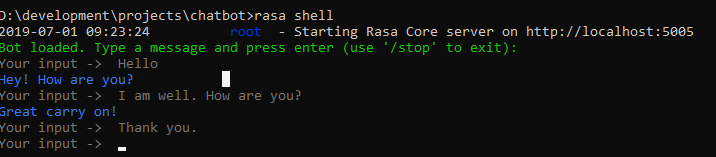

## rasa-chatbot
Rasa Open Source supplies the building blocks for creating virtual assistants. Use Rasa to automate human-to-computer interactions anywhere from websites to social media platforms.

Rasa Open Source provides three main functions. 
1. **Natural Language Understanding** : Convert raw text from user messages into structured data. Parse the user’s intent and extract important key details.
2. **Dialogue Management** : Machine learning-powered dialogue management decides what the assistant should do next, based on the user’s message and context from the conversation.
3. **Integrations** : Built-in integration points for over 10 messaging channels, plus endpoints to connect with databases, APIs, and other data sources.
Together, they provide everything you need to build a virtual assistant.

# Steps
- (Optional) Create a new virtual environment by choosing a Python interpreter and making a ./venv directory to hold it:
```
python3 -m venv ./venv
```
Activate the virtual environment:
```
source ./venv/bin/activate
```
- Install Rasa Open Source using pip (requires Python 3.7, or 3.8).
```
pip3 install -U --user pip && pip3 install rasa
```
- Intialize fresh project
```
rasa init
```

# Folder Structure
Files
domain.yml → the “universe” of the bot, i.e., it has a list of all the intents, responses, custom actions, slots, and forms. Don’t forget that every time you add a new intent or entity you have to also add it in your domain

data/nlu.yml → the training data for the natural language understanding component. You add your intents with annotated entities if any, as well as synonyms.

data/stories.yml → the training data for the core-dialogue management component. You add sample dialogue flows, in order for your bot to learn how to interact with users after recognizing the intent

data/rules.yml → part of the training data for the core-dialogue management component. You add snippets of conversations that should always follow the same flow

config.yml → the configuration has the pipeline of the bot, it has all the training information and the policies that should be followed

endpoints.yml → details for connecting to channels

credentials.yml → details for connecting to other services. Rasa already has written services, e.g., Facebook, Slack, so if you want to use them you just comment out the lines

actions/actions.py → the custom actions are your code, where you can call APIs, connect with database, validate slots, etc.

tests/ → the end-to-end tests of rasa. All files in this folder have to start with test_conversation to be considered for the testing

models/ → where your models are stored. Once you train a model this folder is automatically created

results/ → where the results of your tests are stored. Once you test a model this folder is automatically created and the files are automatically updated after every test


# Commands
function | command 
--- | --- 
*Training (parameters, policies, and custom components)* | `rasa train` 
*Training nlu only* | `rasa train nlu`
*Talk to your bot* | `rasa shell`
*Talk and see behind the scene of bot* | `rasa shell --debug `
*Talk (intent and entity recognition)* | `rasa shell nlu`
*Run custom python codes* | `rasa run actions`
*Test conversation with testing dialogue* | `rasa test`
*Choose specific model to interact* | `rasa interactive -m models/<modelname>`
*Takes latest model by default to conversation* | `rasa interactive`
*Visualize the conversation* | `rasa visualize`



